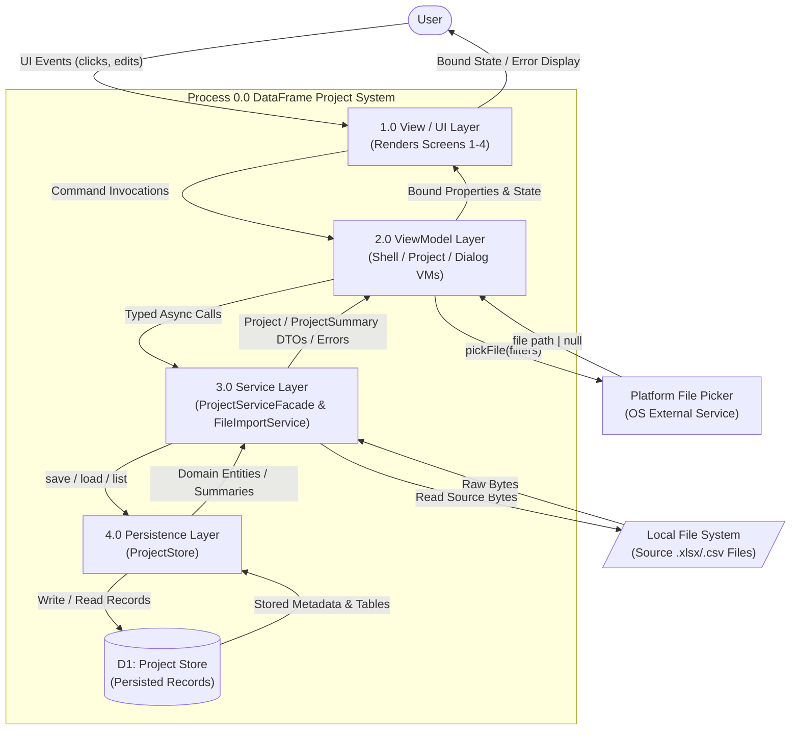
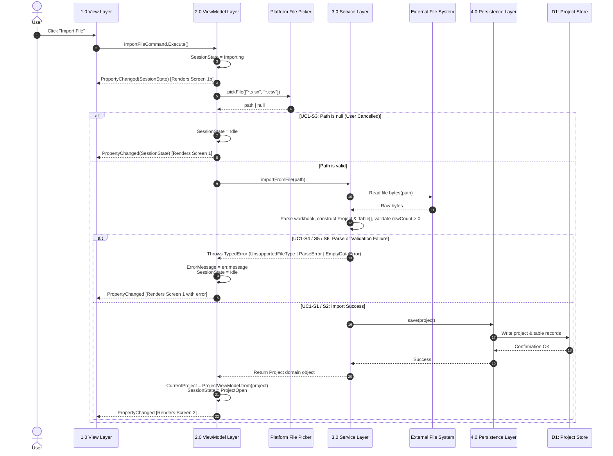

# Sprint Specification: Level-1 DFD & Architecture Contracts

## 1. Context & Architecture Rules

This specification defines **Level-1 DFD (DFD1)**, exploding process `0.0` into distinct subsystems, establishing explicit interface contracts between boundaries, and mapping end-to-end data flows.

### Structural Discipline & Boundary Constraints

1. **DFD Leveling:** Process `0.0` is decomposed into constituent layer processes (`1.0 View`, `2.0 ViewModel`, `3.0 Service`, `4.0 Persistence`).
2. **Strict Boundary Enclosure:** A subsystem is defined entirely by what flows across its boundaries. No internal implementation details are leaked or accessed across layers.
3. **No-Skip Boundary Rule:** Data flows may only cross adjacent boundary walls (e.g., `View` $\rightarrow$ `ViewModel` $\rightarrow$ `Service` $\rightarrow$ `Persistence`). Direct cross-layer skipping (e.g., `View` $\rightarrow$ `Service` or `ViewModel` $\rightarrow$ `Persistence`) is strictly forbidden.
   * *Documented Exception:* `2.0 ViewModel` $\leftrightarrow$ `Platform File Picker` via dependency injection (`IFilePickerService`), keeping platform dialog invocation decoupled from UI views and testable in isolation.
4. **Data Store vs External Entity Partitioning:** 
   * **`Local File System` (External Entity):** Unmanaged arbitrary source files (`.xlsx`, `.csv`) residing outside system ownership.
   * **`D1: Project Store` (Data Store):** App-owned persisted project and table records managed exclusively by `4.0 Persistence`.

---

## 2. Level-1 Data Flow Diagram (DFD1)



---

## 3. Boundary Subsystem Contracts

Contracts define the **exact surface area** exposed between adjacent subsystems. Nothing outside these explicitly defined signatures may be imported, invoked, or referenced.

### 1.0 View ↔ 2.0 ViewModel Contract

* **View Reads (One-Way / Bound):**
  * `SessionState`, `CurrentProject`, `ErrorMessage`
  * Dialog-specific fields: `AvailableProjects`, `SelectedProject`, `IsLoading`, `Message`
* **View Writes (Invocations):**
  * Invokes ViewModel commands: `ImportFileCommand`, `OpenProjectCommand`, `CloseProjectCommand`
  * Dialog commands: `ConfirmCommand`, `CancelCommand`, `SaveAndCloseCommand`, `CloseWithoutSavingCommand`
  * Two-way bound fields strictly limited to UI input bindings (e.g., `SelectedProject`).
* **Invariants & Restrictions:**
  * View **must never** reference or import the Service or Persistence layers.
  * View **must never** instantiate or hold domain entities (`Project`, `Table`).

---

### 2.0 ViewModel ↔ 3.0 Service Contract (`ProjectService` Facade)

```typescript
interface IProjectService {
  importFromFile(pathOrDescriptor: FileDescriptor): Promise<Project>;
  // Throws: UnsupportedFileTypeError | ParseError | EmptyDataError | DuplicateProjectNameError

  load(id: string): Promise<Project>;
  // Throws: ProjectNotFoundError | StoreReadError

  close(id: string): Promise<void>;
  // Throws: StoreWriteError

  forceClose(id: string): void;
  // Memory-only cleanup; never throws

  listProjectSummaries(): Promise<ProjectSummaryVM[]>;
}
```

* **Invariants & Restrictions:**
  * ViewModel **must never** import or instantiate `FileImportService` or `ProjectStore` directly. `ProjectService` acts as the single entry point.
  * Mapping domain models (`Project`) to ViewModel representations (`ProjectViewModel`, `TableSummaryVM`) occurs exclusively on the ViewModel side of the boundary.
  * `ProjectService` coordinates hydration: it transforms raw `ProjectRecordDTO` from `ProjectStore` into domain `Project` instances containing in-memory Danfo.js `DataFrame`s.

---

### 3.0 Service ↔ 4.0 Persistence Contract (`ProjectStore` - Option A)

```typescript
export interface TableRecordDTO {
  id: string;
  projectId: string;
  name: string;
  sheetIndex?: number | null;
  rowCount: number;
  columns: Array<{ name: string; index: number; inferredType: string }>;
  data: Record<string, unknown>[]; // Serialized table rows
  createdAt: string;
}

export interface ProjectRecordDTO {
  id: string;
  name: string;
  createdAt: string;
  updatedAt: string;
  sourceType: 'xlsx' | 'csv';
  sourceFilePath: string;
  status: 'open' | 'closed';
  tables: TableRecordDTO[];
}

export interface ProjectSummaryDTO {
  id: string;
  name: string;
  sourceType: 'xlsx' | 'csv';
  tableCount: number;
  updatedAt: string;
}

interface IProjectStore {
  save(record: ProjectRecordDTO): Promise<void>;
  // Throws: StoreWriteError | DuplicateProjectNameError

  loadRecord(id: string): Promise<ProjectRecordDTO>;
  // Throws: StoreReadError | ProjectNotFoundError

  listProjects(): Promise<ProjectSummaryDTO[]>;
  // Throws: StoreReadError

  existsByName(name: string, excludeId?: string): Promise<boolean>;
}
```

* **Invariants & Restrictions:**
  * `ProjectStore` **must never** reference domain classes (`Project`, `Table`) or ViewModel types. It deals strictly in serialized DTOs (`ProjectRecordDTO`, `ProjectSummaryDTO`).
  * `ProjectStore` serializes/deserializes zip archives (`project.json`, `tables/{id}/metadata.json`, `tables/{id}/data.json`).

---

### 3.0 Service ↔ External Local File System (`FileImportService`)

```typescript
// Internal helper within 3.0 Service boundary — not exposed to 2.0 ViewModel
interface IFileImportService {
  parse(file: FileDescriptor): Promise<{ project: Project }>;
  // Throws: UnsupportedFileTypeError | ParseError | EmptyDataError
}
```

* **Invariants & Restrictions:**
  * Uses `SheetJS` / `xlsx` and `papaparse` + `Danfo.js` to parse file buffers into DataFrames.
  * OS/IO exceptions must be caught and converted into strongly-typed domain errors before crossing into `ProjectService`.

---

### 2.0 ViewModel ↔ Platform Universal File Picker

```typescript
export interface FileDescriptor {
  path: string;
  name: string;
  buffer?: ArrayBuffer;
  source: 'electron-native' | 'browser-picker';
}

interface IFilePickerService {
  pickFile(filters: string[]): Promise<FileDescriptor | null>;
}
```

* **Universal File Adapter Behavior:**
  * In an Electron environment, invokes native `dialog.showOpenDialog` and retrieves the file path.
  * In a browser/preview environment, opens an HTML5 file picker / handles drag & drop, providing the file descriptor and ArrayBuffer.

---

### Error Taxonomy

All custom application errors extend a base `AppError` class:

```typescript
export abstract class AppError extends Error {
  abstract readonly code: string;
  readonly details?: unknown;
  constructor(message: string, details?: unknown) {
    super(message);
    this.name = this.constructor.name;
  }
}

export class UnsupportedFileTypeError extends AppError { readonly code = 'UNSUPPORTED_FILE_TYPE'; }
export class ParseError extends AppError { readonly code = 'PARSE_ERROR'; }
export class EmptyDataError extends AppError { readonly code = 'EMPTY_DATA_ERROR'; }
export class StoreWriteError extends AppError { readonly code = 'STORE_WRITE_ERROR'; }
export class StoreReadError extends AppError { readonly code = 'STORE_READ_ERROR'; }
export class ProjectNotFoundError extends AppError { readonly code = 'PROJECT_NOT_FOUND'; }
export class DuplicateProjectNameError extends AppError { readonly code = 'DUPLICATE_PROJECT_NAME'; }
```

---

## 4. End-to-End Sequence Diagram (UC1-S1 Import File Flow)

