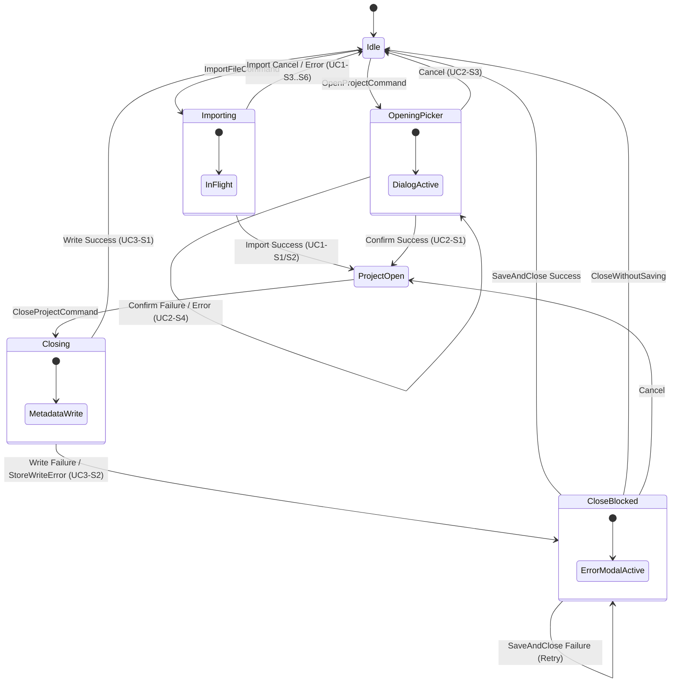

# Sprint Specification: Session State Machine & Lifecycle

## 1. Overview & Rationale

Managing workspace session lifecycle using disconnected boolean flags (such as `IsBusy`, `IsProjectOpen`, or null-checks on `CurrentProject`) introduces the risk of invalid, inconsistent UI states (e.g., `IsBusy == false` while an implicit modal dialog task is still running).

To establish deterministic UI rendering and command execution, the workspace root uses an explicit **`SessionState` state machine**. This state machine serves as the single source of truth driving:
1. Active screen and overlay rendering.
2. Command `CanExecute` evaluations.
3. Session persistence lifecycle hooks.

---

## 2. SessionState Domain Model

```csharp
public enum SessionState
{
    Idle,           // Workspace blank; no project loaded; ready for action
    Importing,      // File import and parsing in progress
    OpeningPicker,  // Open Project dialog active
    ProjectOpen,    // Project loaded and actively open in workspace
    Closing,        // Save/close operation in progress (transient)
    CloseBlocked    // Save failed on close; failure modal displayed over open project
}
```

### State-to-Screen Mapping

| `SessionState` | Active Screen / View | Description / Overlays |
| :--- | :--- | :--- |
| **`Idle`** | **Screen 1** (Blank Shell) | Idle blank workspace. Entry commands enabled. |
| **`Importing`** | **Screen 1b** (Blank Shell - Busy) | Import file operation in flight. Action buttons disabled. |
| **`OpeningPicker`** | **Screen 3 / 3b** (Open Project Modal) | Modal dialog open over Screen 1 background. |
| **`ProjectOpen`** | **Screen 2** (Project Loaded) | Active project display with table summary metadata. |
| **`Closing`** | **Screen 2** (Project Loaded) | Transient state during close execution (optional inline indicator). |
| **`CloseBlocked`** | **Screen 2 + Screen 4 Overlay** | Close failure modal overlaying active project workspace. |

---

## 3. Mermaid State Transition Diagram



---

## 4. State Transition Table

| From State | Trigger / Action | Guard / Condition | To State | Side Effects & Notes |
| :--- | :--- | :--- | :--- | :--- |
| **`Idle`** | `ImportFileCommand` | `SessionState == Idle` | **`Importing`** | Opens native file picker. |
| **`Idle`** | `OpenProjectCommand` | `SessionState == Idle` | **`OpeningPicker`** | Launches `OpenProjectDialogViewModel`. |
| **`Importing`** | Parse & Load Succeeds | UC1-S1/S2 | **`ProjectOpen`** | Populate `CurrentProject`; write `Project.status = "open"`. |
| **`Importing`** | Picker Cancelled or Error | UC1-S3–S6 | **`Idle`** | Set `Shell.ErrorMessage`; `CurrentProject` remains `null`. |
| **`OpeningPicker`** | `CancelCommand` | — | **`Idle`** | Dialog closes with `null` result. |
| **`OpeningPicker`** | `ConfirmCommand` Succeeds | `SelectedProject != null` | **`ProjectOpen`** | Load project; set `CurrentProject`; write `Project.status = "open"`. |
| **`OpeningPicker`** | `ConfirmCommand` Fails | Load error / UC2-S4 | **`OpeningPicker`** | Dialog remains open; set `Dialog.ErrorMessage`. |
| **`ProjectOpen`** | `CloseProjectCommand` | `SessionState == ProjectOpen` | **`Closing`** | Begin metadata update & close sequence. |
| **`Closing`** | Store Write Succeeds | UC3-S1 | **`Idle`** | Write `Project.status = "closed"`; clear `CurrentProject`. |
| **`Closing`** | Store Write Fails | UC3-S2 (`StoreWriteError`) | **`CloseBlocked`** | Retain `CurrentProject`; launch `CloseFailureDialogViewModel`. |
| **`CloseBlocked`** | `SaveAndCloseCommand` Succeeds | — | **`Idle`** | Write `Project.status = "closed"`; clear `CurrentProject`. |
| **`CloseBlocked`** | `SaveAndCloseCommand` Fails | — | **`CloseBlocked`** | Modal remains open; update error message. |
| **`CloseBlocked`** | `CloseWithoutSavingCommand` | — | **`Idle`** | Force close without metadata save; set `Project.status = "closed"`. |
| **`CloseBlocked`** | `CancelCommand` | — | **`ProjectOpen`** | Abort close attempt; retain open project and active UI. |

---

## 5. Updated ViewModel Specifications

### ShellViewModel Architecture Refactor

By replacing boolean status flags (`IsBusy`) with `SessionState`, the `ShellViewModel` eliminates state synchronization bugs.

| Field / Command | Type / Signature | Behavior / Rules |
| :--- | :--- | :--- |
| **`SessionState`** | `SessionState` *(Property)* | **Single source of truth** for workspace screen rendering and command authorization. |
| **`CurrentProject`** | `ProjectViewModel?` | Populated on entering `ProjectOpen`. Retained during `Closing` and `CloseBlocked`. Cleared upon reaching `Idle`. |
| **`ErrorMessage`** | `string?` | Set on `Importing` $\rightarrow$ `Idle` failure paths; cleared on next command execution. |
| **`ImportFileCommand`** | Command | `CanExecute:` `SessionState == SessionState.Idle`<br/>*Action:* Transitions `SessionState` to `Importing`. |
| **`OpenProjectCommand`** | Command | `CanExecute:` `SessionState == SessionState.Idle`<br/>*Action:* Transitions `SessionState` to `OpeningPicker`. |
| **`CloseProjectCommand`**| Command | `CanExecute:` `SessionState == SessionState.ProjectOpen`<br/>*Action:* Transitions `SessionState` to `Closing`. |

> **Note on Dialog Sub-States:** Dialog ViewModels (`OpenProjectDialogViewModel`, `CloseFailureDialogViewModel`) maintain local `IsLoading` or `IsBusy` flags for internal operation feedback (e.g., retrying disk write inside modal). These sub-states are scoped locally to the dialogs and do not pollute the root `ShellViewModel.SessionState`.

---

## 6. Durability & Persistence Logic

Transient session states (`Importing`, `OpeningPicker`, `Closing`, `CloseBlocked`) exist strictly in-memory within ViewModel logic and are not written to disk.

Persistent `Project.status` flags are updated **only** on durable boundary transitions:

1. **Entering `ProjectOpen`:** Write persistent record `Project.status = "open"`.
2. **Transitioning to `Idle` from `Closing` or `CloseBlocked`:** Write persistent record `Project.status = "closed"`.