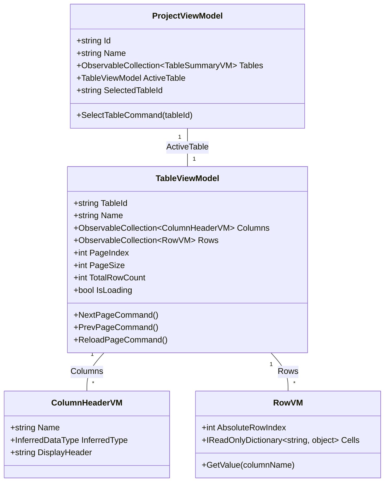

# Data Model & ViewModel Specification: Data Grid & Pagination

## 1. Domain Data Entities & Slices

To support virtualized rendering of large DataFrames without loading full datasets into UI memory, Sprint 2 introduces lightweight slice models. Data access is structured around paged chunks retrieved on demand from the `.pipeforge` container store.

---

### 1.1 TablePage (Domain Slice Entity)

The `TablePage` entity represents an immutable chunk of rows fetched from an underlying table or partition file.

```csharp
public class TablePage
{
    public string TableId { get; init; }
    public int PageIndex { get; init; }       // 0-based page index
    public int PageSize { get; init; }        // Number of rows per page (e.g., 50)
    public int TotalRowCount { get; init; }    // Total rows in parent table
    public int StartRowIndex { get; init; }   // Absolute row offset: PageIndex * PageSize
    public IReadOnlyList<ColumnDef> Columns { get; init; }
    public IReadOnlyList<IReadOnlyDictionary<string, object?>> Rows { get; init; }
}
```

#### Field Specifications

| Property | Type | Description / Constraints |
| :--- | :--- | :--- |
| **TableId** | `string` | Foreign key referencing the parent domain `Table.id`. |
| **PageIndex** | `int` | Zero-based index of the active page slice ($PageIndex \ge 0$). |
| **PageSize** | `int` | Maximum row count contained in the page slice ($PageSize > 0$). |
| **TotalRowCount** | `int` | Total row count across the entire table (used for bounds calculation). |
| **StartRowIndex** | `int` | Absolute starting index offset calculated as $PageIndex \times PageSize$. |
| **Columns** | `IReadOnlyList<ColumnDef>` | Schema metadata for columns present in this slice. |
| **Rows** | `IReadOnlyList<IReadOnlyDictionary<string, object?>>` | Row data array where each row is a map of column names to primitive values. |

---

### 1.2 ColumnDef & ColumnHeaderVM

Structural metadata defining DataFrame schema headers and data type inferences. Spreadsheet-style lettering ($A, B, C$) is explicitly omitted.

```csharp
public record ColumnDef(
    string Name,
    InferredDataType InferredType,
    int OrdinalIndex
);

public enum InferredDataType
{
    String,
    Int64,
    Float64,
    Boolean,
    DateTime,
    Unknown
}
```

```csharp
public class ColumnHeaderVM
{
    public string Name { get; }
    public InferredDataType InferredType { get; }
    public string DisplayHeader => $"{Name} ({InferredType})";

    public ColumnHeaderVM(ColumnDef domainDef)
    {
        Name = domainDef.Name;
        InferredType = domainDef.InferredType;
    }
}
```

---

## 2. ViewModel Architecture & Specifications

### 2.1 TableViewModel (Read-Only Data Grid & Pagination)

`TableViewModel` manages the state for a single active table tab, including pagination bounds, row slice caching, and grid display headers. It contains zero mutation or edit commands.

```
+-----------------------------------------------------------------------------------+
|  TableViewModel                                                                   |
+-----------------------------------------------------------------------------------+
|  - TableId: string                                                                |
|  - Name: string                                                                   |
|  - Columns: ObservableCollection<ColumnHeaderVM>                                  |
|  - Rows: ObservableCollection<RowVM>                                              |
|  - PageIndex: int                                                                 |
|  - PageSize: int                                                                  |
|  - TotalRowCount: int                                                             |
|  - IsLoading: bool                                                                |
|  - ErrorMessage: string?                                                          |
+-----------------------------------------------------------------------------------+
|  + DisplayPageNumber: int              (computed: PageIndex + 1)                  |
|  + TotalPages: int                     (computed: ceil(TotalRowCount / PageSize)) |
|  + PageRangeText: string               (computed: e.g., "1 - 50 of 1200")         |
|  + NextPageCommand: ICommand                                                      |
|  + PrevPageCommand: ICommand                                                      |
|  + ReloadPageCommand: ICommand                                                    |
+-----------------------------------------------------------------------------------+
```

#### Property & Field Specifications

| Property / Field | Type | Binding / Sync Source | Description / Rules |
| :--- | :--- | :--- | :--- |
| **TableId** | `string` | `Table.id` | Immutable table identifier. |
| **Name** | `string` | `Table.name` | Display title for workspace tab item. |
| **Columns** | `ObservableCollection<ColumnHeaderVM>` | Derived from `TablePage.Columns` | Header objects driving grid column creation and data type rendering. |
| **Rows** | `ObservableCollection<RowVM>` | Derived from `TablePage.Rows` | Row data for current page slice only. Fixed row index column calculates $StartRowIndex + RowOffset$. |
| **PageIndex** | `int` | Local VM State | Current zero-based page index ($0$-based). |
| **PageSize** | `int` | App Config / Default `50` | Number of rows rendered per page. |
| **TotalRowCount** | `int` | `TablePage.TotalRowCount` | Drives total page count and boundary evaluations. |
| **TotalPages** | `int` | Calculated | $\lceil \frac{TotalRowCount}{PageSize} \rceil$ (returns $1$ if $TotalRowCount == 0$). |
| **DisplayPageNumber** | `int` | Calculated | $PageIndex + 1$ ($1$-based for UI label displays). |
| **PageRangeText** | `string` | Calculated | Formatted string (e.g., `"51 - 100 of 1204"`). |
| **IsLoading** | `bool` | Local VM State | `true` during async slice fetches; disables pagination controls. |
| **ErrorMessage** | `string?` | Local VM State | Populated on `StoreReadError`; triggers inline grid error notification. |

#### Command Specifications

```csharp
// Next Page Command Guard
public bool CanExecuteNextPage() =>
    !IsLoading && (PageIndex + 1) * PageSize < TotalRowCount;

// Previous Page Command Guard
public bool CanExecutePrevPage() =>
    !IsLoading && PageIndex > 0;
```

| Command | CanExecute Guard | Execution Logic / Side Effects |
| :--- | :--- | :--- |
| **NextPageCommand** | `!IsLoading && (PageIndex + 1) * PageSize < TotalRowCount` | Increments `PageIndex`, calls `LoadPageAsync(PageIndex + 1)`. |
| **PrevPageCommand** | `!IsLoading && PageIndex > 0` | Decrements `PageIndex`, calls `LoadPageAsync(PageIndex - 1)`. |
| **ReloadPageCommand** | `!IsLoading` | Retries `LoadPageAsync(PageIndex)` following a read failure. |

---

### 2.2 RowVM Representation

`RowVM` encapsulates a single row slice entry for virtualized row display.

```csharp
public class RowVM
{
    public int AbsoluteRowIndex { get; }  // e.g., 50, 51, 52...
    public IReadOnlyDictionary<string, object?> Cells { get; }

    public RowVM(int absoluteIndex, IReadOnlyDictionary<string, object?> cells)
    {
        AbsoluteRowIndex = absoluteIndex;
        Cells = cells;
    }

    public object? GetValue(string columnName) =>
        Cells.TryGetValue(columnName, out var val) ? val : null;
}
```

---

### 2.3 ProjectViewModel (Workspace & Tab Management Extensions)

`ProjectViewModel` is extended to support multi-table tab selection and active table VM instantiation.

| Property / Command | Type / Signature | Details & Behaviors |
| :--- | :--- | :--- |
| **Tables** | `ObservableCollection<TableSummaryVM>` | Metadata collection representing all sheets/tables in the project. |
| **ActiveTable** | `TableViewModel?` | Active table VM instance currently displayed in the workspace grid view. |
| **SelectedTableId** | `string?` | ID of the currently active table tab. |
| **SelectTableCommand** | `ICommand` (parameter: `tableId`) | Switches `SelectedTableId`, instantiates or retrieves the cached `TableViewModel`, and triggers `LoadPageAsync(0)`. |



---

## 3. Boundary & Service Contracts

### 3.1 Extended IProjectService Facade Contract

```csharp
public interface IProjectService
{
    // Existing Sprint 1 Contracts
    Task<Project> LoadAsync(string id);
    Task CloseAsync(string id);
    void ForceClose(string id);
    Task<IEnumerable<ProjectSummaryVM>> ListProjectSummariesAsync();

    // Extended Sprint 2 Grid & Pagination Contracts
    Task<TablePage> GetTablePageAsync(string projectId, string tableId, int pageIndex, int pageSize);
}
```

### 3.2 Extended IProjectStore Persistence Contract

```csharp
public interface IProjectStore
{
    // Existing Sprint 1 Contracts
    Task SaveAsync(Project project);
    Task<Project> LoadFullAsync(string id);
    Task<IEnumerable<ProjectSummaryVM>> ListProjectsAsync();

    // Extended Sprint 2 Direct Page Read Contract
    Task<TablePage> ReadTablePageAsync(string projectId, string tableId, int pageIndex, int pageSize);
}
```

---

## 4. UI Grid Binding Rules & Structural Invariants

1. **Strict Read-Only Enforcement:** No two-way bindings exist on cell value targets. Editors and mutation pipelines are completely omitted from `TableViewModel`.
2. **Virtualization Alignment:** Rows are loaded exclusively in paged slices ($PageSize \le 100$). Entire datasets are never pulled into ViewModel collections.
3. **Index Formatting:** The leftmost fixed grid column displays `AbsoluteRowIndex` ($0$-based index derived from $PageIndex \times PageSize + RowOffset$).
4. **Header Format:** Headers explicitly display `DisplayHeader` (`"ColumnName (Type)"`) and omit Excel column letters ($A, B, C$).