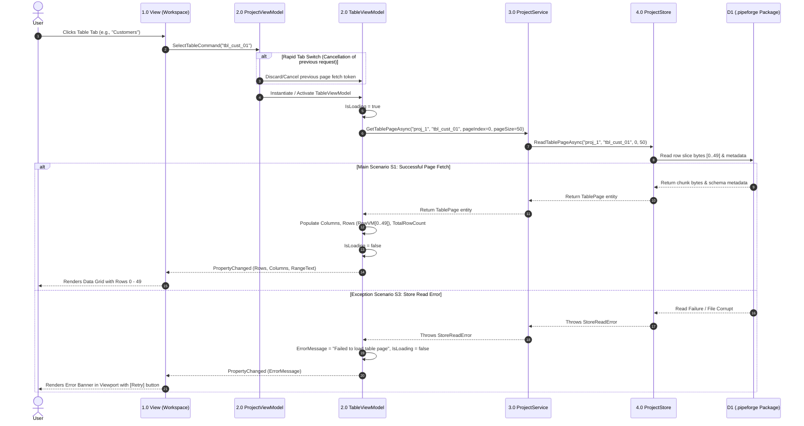
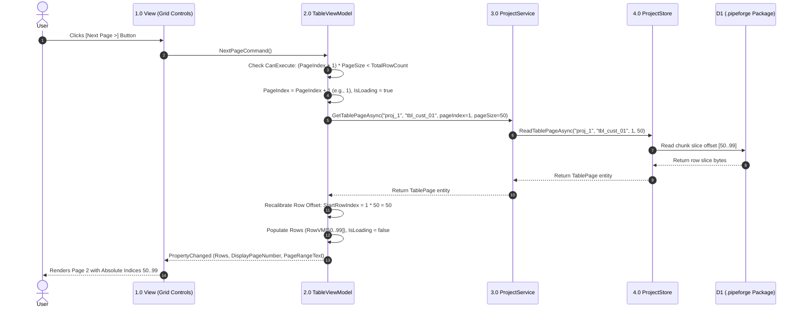
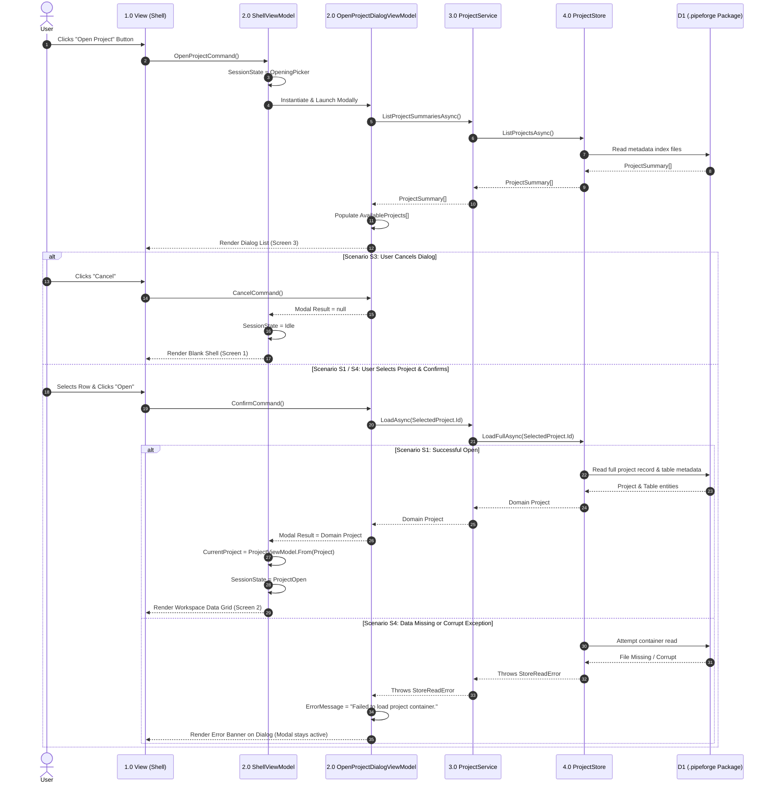

# DataFrame Workspace: UI Wireframes, Architecture Contracts & Sequence Diagrams

---

## 1. UI Wireframes & Layout Specifications

### 1.1 Screen Layout — Workspace Data Grid Viewport & Pagination Controls

* **Bound ViewModel:** `ProjectViewModel` (Workspace) & `TableViewModel` (Active Table Grid)
* **Precondition:** `Shell.SessionState == ProjectOpen`
* **Layout Principles:**
  * **No Spreadsheet Lettering:** Headers display real domain column names with inferred types (`Name (Type)`). Excel headers ($A, B, C$) are strictly omitted.
  * **$0$-Based Row Indexing:** The leftmost fixed column renders absolute row indices calculated as $PageIndex \times PageSize + RowOffset$.
  * **Strict Read-Only:** Grid cells contain no two-way bindings or inline cell editors.

```
+-----------------------------------------------------------------------------------+
|  DataFrame Project Tool                                                    [-][x] |
+-----------------------------------------------------------------------------------+
|  Project: "Sales_Analysis.pipeforge"                        +------------------+  |
|                                                             |  Close Project   |  |
|                                                             +------------------+  |
|                                                             Shell.CloseProjectCmd |
+-----------------------------------------------------------------------------------+
|  Tab Bar:  [ [x] Customers ]  ( ) Orders   ( ) LineItems                          |
|            bound to ProjectViewModel.Tables / SelectTableCommand(tableId)         |
+-----------------------------------------------------------------------------------+
| Index | Customer_ID (Int64) | Full_Name (String)    | Lifetime_Value (Float64) |  |
|=======|=====================|=======================|==========================|  |
| 50    | 1051                | Alice Smith           | 1240.50                  |  |
| 51    | 1052                | Bob Jones             | 890.00                   |  |
| 52    | 1053                | Carol Danvers         | 4320.10                  |  |
| ...   | ...                 | ...                   | ...                      |  |
| 99    | 1100                | David Miller          | 150.25                   |  |
+-----------------------------------------------------------------------------------+
|  [< Prev Page]   Page 2 of 25  (Rows 51 - 100 of 1204)   [Next Page >]  [Reload] |
|  PrevPageCmd     DisplayPageNum TotalPages PageRangeText NextPageCmd    ReloadCmd |
|  CanExecute:     (computed)     (computed) (computed)    CanExecute:    !IsLoading|
|  PageIndex > 0                                           (PageIndex+1)*PageSize   |
|                                                          < TotalRowCount          |
+-----------------------------------------------------------------------------------+
```

---

### 1.2 Grid Loading, Empty & Error States

#### A. Read Failure / Container Error State
When `ProjectService.getTablePageAsync()` fails due to a container read exception (`StoreReadError`), the grid viewport renders an error banner while preserving active workspace session state.

```
+-----------------------------------------------------------------------------------+
| Index | Column Header 1     | Column Header 2       | Column Header 3          |  |
+-----------------------------------------------------------------------------------+
|                                                                                   |
|     [!] Failed to read table page chunk from storage container.                   |
|         Error: StoreReadError - Partition chunk missing or corrupt.              |
|                                                                                   |
|                                 +---------------+                                 |
|                                 |  Retry Fetch  |                                 |
|                                 +---------------+                                 |
|                                 ReloadPageCommand                                 |
|                                                                                   |
+-----------------------------------------------------------------------------------+
|  [< Prev Page] (Disabled)    Page 1 of 1    Rows 0 - 0 of 0   [Next Page >] (Dis.) |
+-----------------------------------------------------------------------------------+
```

#### B. Empty Table State ($TotalRowCount = 0$)
```
+-----------------------------------------------------------------------------------+
| Index | Customer_ID (Int64) | Full_Name (String)    | Lifetime_Value (Float64) |  |
+-----------------------------------------------------------------------------------+
|                                                                                   |
|                         Table contains no data rows.                              |
|                                                                                   |
+-----------------------------------------------------------------------------------+
|  [< Prev Page] (Disabled)    Page 1 of 1    Rows 0 - 0 of 0   [Next Page >] (Dis.) |
+-----------------------------------------------------------------------------------+
```

---

### 1.3 UI Binding Reference Table

| UI Element | ViewModel Target | Binding Mode / Expression | Behavioral Rules |
| :--- | :--- | :--- | :--- |
| **Table Tab Buttons** | `ProjectViewModel.Tables` | `ItemsSource` | Tab headers rendered for each table summary. |
| **Active Tab Switch** | `SelectTableCommand` | `Command` (Param: `tableId`) | Swaps `ActiveTable` VM instance and loads Page $0$. |
| **Column Headers** | `TableViewModel.Columns` | `ItemsSource` | Renders `ColumnHeaderVM.DisplayHeader` (`"Name (Type)"`). |
| **Row Slice Items** | `TableViewModel.Rows` | `ItemsSource` | Binds active page row collection (`RowVM[]`). |
| **Index Column** | `RowVM.AbsoluteRowIndex` | One-Way Text | Renders $0$-based index ($PageIndex \times PageSize + RowOffset$). |
| **Prev Page Button** | `PrevPageCommand` | `Command` | Enabled when `PageIndex > 0 && !IsLoading`. |
| **Next Page Button** | `NextPageCommand` | `Command` | Enabled when `(PageIndex + 1) * PageSize < TotalRowCount && !IsLoading`. |
| **Page Indicator** | `DisplayPageNumber`, `TotalPages` | One-Way Text | Displays formatted string: `"Page X of Y"`. |
| **Range Indicator** | `PageRangeText` | One-Way Text | Displays formatted range: `"Rows A - B of Total"`. |
| **Reload Button** | `ReloadPageCommand` | `Command` | Retries `GetTablePageAsync` on fetch failure. |

---

## 2. Architecture Contracts & Layer Decomposition

### 2.1 Level-1 Data Flow Diagram (DFD1) & Boundary Invariants

```
+--------+
|  User  |
+--------+
    | UI Input (Tab Switch, Page Navigation)
    v
+---------------------------------------------------------+
| 1.0 Presentation Layer (View / UI Data Grid)            |
+---------------------------------------------------------+
    ^                                        |
    | Property Binds                         | Command Invocations
    v                                        v
+---------------------------------------------------------+
| 2.0 ViewModel Layer (TableViewModel / ProjectViewModel) |
+---------------------------------------------------------+
    ^                                        |
    | TablePage Slice DTOs                   | Facade Method Calls
    v                                        v
+---------------------------------------------------------+
| 3.0 Service Layer (ProjectService Facade)               |
+---------------------------------------------------------+
    ^                                        |
    | TablePage Slice DTOs                   | Persistence Reads
    v                                        v
+---------------------------------------------------------+
| 4.0 Persistence Layer (ProjectStore / ZipPackageStore)  |
+---------------------------------------------------------+
    |
    v
+---------------------------------------------------------+
| D1: Persisted Package Storage (.pipeforge container)     |
+---------------------------------------------------------+
```

#### Strict Layer Boundary Rules
1. **Adjacent Calls Only:** Lower layers must never call upward. Views bind exclusively to ViewModels; ViewModels call `IProjectService`; `ProjectService` calls `IProjectStore`.
2. **Zero ViewModel Leaks in Store:** `IProjectStore` speaks exclusively in domain entities (`Project`, `TablePage`) and DTOs.
3. **No In-Memory Entire-Dataset Loads:** Grid operations pass page bounds ($PageIndex$, $PageSize$) down through all layers to stream paged slices from disk.

---

### 2.2 Layer Interface Contracts

#### A. ViewModel $\leftrightarrow$ Service Contract (`IProjectService`)

```csharp
public interface IProjectService
{
    // Session & Lifecycle Operations
    Task<Project> LoadAsync(string id);
    Task CloseAsync(string id);
    void ForceClose(string id);
    Task<IEnumerable<ProjectSummaryVM>> ListProjectSummariesAsync();

    // Import Operations
    Task<ImportPreview> PreviewImportAsync(string path);
    Task<Project> FinalizeImportAsync(ImportPreview preview, string name, string saveDirectory);
    Task<bool> IsNameUniqueAsync(string name);

    // Data Grid Pagination Contract
    Task<TablePage> GetTablePageAsync(string projectId, string tableId, int pageIndex, int pageSize);
    
    // Project Deletion
    Task DeleteProjectAsync(string id);
}
```

#### B. Service $\leftrightarrow$ Persistence Contract (`IProjectStore`)

```csharp
public interface IProjectStore
{
    Task SaveAsync(Project project);
    Task<Project> LoadFullAsync(string id);
    Task<IEnumerable<ProjectSummaryVM>> ListProjectsAsync();
    Task DeleteAsync(string id);

    // Container Direct Page Chunk Reader Contract
    Task<TablePage> ReadTablePageAsync(string projectId, string tableId, int pageIndex, int pageSize);
}
```

---

### 2.3 Exception & Error Taxonomy

```
AppError (Base Exception)
 ├── ParseError (Corrupt or unreadable XLSX/CSV file bytes)
 ├── UnsupportedFileTypeError (Invalid file extension)
 ├── EmptyDataError (Workbook contains zero data rows)
 ├── NameCollisionError (Target project name already exists in store)
 ├── ProjectNotFoundError (Target project ID not present in store)
 ├── TableNotFoundError (Target table ID not found within project container)
 ├── StoreReadError (Failed to read package container or chunk file from disk)
 └── StoreWriteError (Failed to write or flush package file to disk)
```

---

## 3. Sequence Diagrams

### 3.1 UC5 — Select Table Tab (Main, Rapid Switch & Read Error Scenarios)



---

### 3.2 UC6 — Navigate Grid Pagination (Next & Prev Page Navigation)



---

### 3.3 UC2 — Open Existing Project (Main, Cancel & Corrupt Exception Scenarios)

