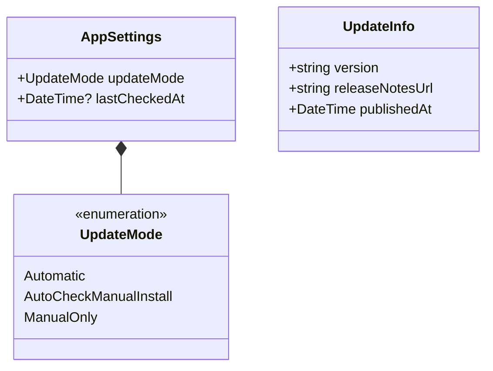
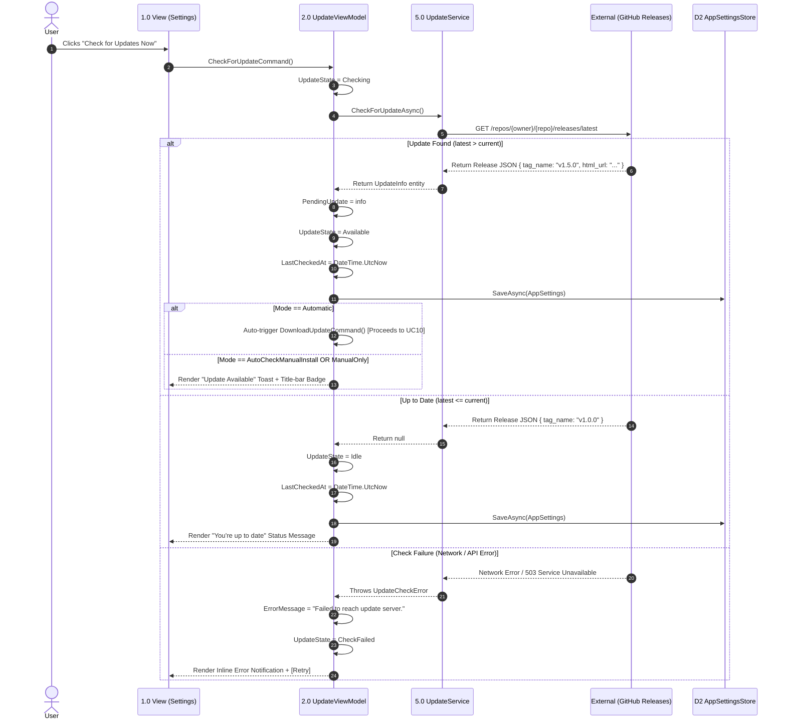
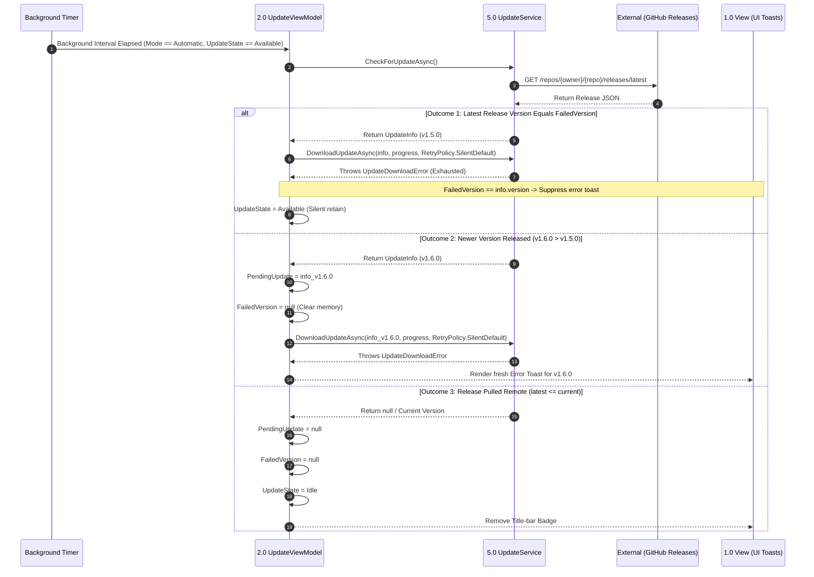

# Sprint 3 Specification: Application Update Management

## 1. Scope & User Stories

### Epic: Application Update Management

This epic covers background and interactive update checks, download management, and application restart workflows. The update subsystem operates independently of active project states, except during application restarts where active projects are safely closed.

#### US1 — Automatic Updates
* **As a** user,
* **I want** updates to be automatically checked, downloaded, and made ready for installation in the background,
* **So that** my application is always up to date without manual intervention.

#### US2 — Manual Check & Manual Install
* **As a** user,
* **I want** to manually trigger update checks and decide when to download and install them,
* **So that** I have total control over bandwidth usage and software updates.

#### US3 — Automatic Check & Manual Install
* **As a** user,
* **I want** the application to check for updates automatically in the background and notify me when one is available,
* **So that** I stay informed of new releases without automatic background downloads occurring.

#### US4 — Configurable Update Mode Selection
* **As a** user,
* **I want** to select my preferred update mode in Settings and have my choice persisted across sessions,
* **So that** the update mechanism conforms to my workflow preference.

#### US5 — Safe Restart & Project Protection
* **As a** user,
* **I want** an active open project to be safely closed before an application restart applies an update,
* **So that** I never risk data loss or container metadata corruption during updates.

#### US6 — Update Status Visibility
* **As a** user,
* **I want** to view the currently installed version and last-checked timestamp at a glance,
* **So that** I can verify my application's update status.

### Explicit Out-of-Scope Items
* Rollback/downgrade to previous application versions.
* Release channels (e.g., Beta vs. Stable selection).
* In-app rendering of full changelogs (links directly out to GitHub Release release pages).
* Custom delta-patch algorithm implementation (relies on underlying standard `electron-updater` defaults).

---

## 2. Use Case Inventory & Detailed Flows

| Use Case ID | Title | Summary |
| :--- | :--- | :--- |
| **UC8** | **Configure Update Mode** | Select update preference mode (`Automatic`, `AutoCheckManualInstall`, `ManualOnly`). |
| **UC9** | **Check for Updates** | Query remote update provider (GitHub Releases) for newer versions. |
| **UC10** | **Download & Install Update** | Stream update asset bytes to local cache with retry policy enforcement. |
| **UC11** | **Restart & Apply Update** | Execute safe workspace close sequence and launch application installer. |

*Scoping Rule:* The update subsystem is session-independent—UC8 through UC10 are never gated by `Shell.SessionState`. The sole deliberate coupling point with `Shell.SessionState` occurs within **UC11** during restart execution.

---

### UC8 — Configure Update Mode

* **Precondition:** Settings $\rightarrow$ Updates panel is open.
* **Trigger:** User selects a radio button option for Update Mode.

#### Scenarios & Executions
* **S1 (Main — Mode Change):** User selects a different mode $\rightarrow$ raises `SetUpdateModeCommand(mode)` $\rightarrow$ persists `AppSettings.updateMode` via `ISettingsStore` $\rightarrow$ `UpdateService` reconfigures its background check timer (running for `Automatic` and `AutoCheckManualInstall`; stopped for `ManualOnly`).
* **S2 (Alt — Unchanged Mode):** User clicks the currently active mode radio button $\rightarrow$ no-op, zero persistence calls.
* **S3 (Alt — Mode Changed During Active Check):** Mode is altered while `UpdateState == Checking` $\rightarrow$ allowed. The in-flight check is never canceled; its result is processed according to the mode active upon response arrival.
* **S4 (Alt — Selection Locked During Download/Install):** `UpdateState` is `Downloading` or `Installing` $\rightarrow$ Mode selector controls are disabled (`IsModeLocked == true`), displaying an explanatory inline note. No command is raised.

---

### UC9 — Check for Updates

* **Precondition:** None.
* **Trigger:** User clicks **Check for Updates Now** (any mode) or background timer fires (`Automatic` or `AutoCheckManualInstall`).

#### Scenarios & Executions
* **S1 (Main — Manual Trigger, Up to Date):** User executes `CheckForUpdateCommand()` $\rightarrow$ queries GitHub Releases $\rightarrow$ $latest \le current$ $\rightarrow$ updates `LastCheckedAt` timestamp $\rightarrow$ UI displays "You're up to date."
* **S2 (Main — Manual Trigger, Update Found):** $latest > current$ $\rightarrow$ populates `PendingUpdate` (`UpdateInfo`).
  * *Under `Automatic` mode:* Auto-advances into UC10 immediately without toast.
  * *Under `AutoCheckManualInstall` or `ManualOnly`:* Renders "Update found" toast and updates title-bar badge.
* **S3 (Main — Background Trigger, Up to Date):** Timer fires $\rightarrow$ $latest \le current$ $\rightarrow$ updates `LastCheckedAt` timestamp silently without UI toasts.
* **S4 (Main — Background Trigger, Update Found):** Timer fires $\rightarrow$ $latest > current$ $\rightarrow$ executes same modal/toast routing as S2.
* **S5 (Exception — Manual Check Failure):** `UpdateService` throws `UpdateCheckError` $\rightarrow$ sets `ErrorMessage` and `UpdateState = CheckFailed` $\rightarrow$ UI displays inline error with **Retry** trigger in Settings.
* **S6 (Exception — Background Check Failure):** Background timer check fails $\rightarrow$ error logged silently; no user-facing error toast rendered. `LastCheckedAt` remains untouched (reflecting last successful check). Background timer schedules retry for next interval.

---

### UC10 — Download & Install Update

* **Precondition:** `PendingUpdate` holds valid `UpdateInfo` (from UC9).
* **Trigger:**
  * *Automatic Mode:* Fires automatically upon UC9 completion.
  * *Manual Modes:* User clicks **Download & Install** on notification toast or Settings panel.

#### Scenarios & Executions
* **S1 (Main — Download Success):** Download begins $\rightarrow$ `UpdateState = Downloading` (`IsModeLocked = true`) $\rightarrow$ renders progress notification toast with percentage updates $\rightarrow$ on completion, `UpdateState = Ready` $\rightarrow$ displays UC11 restart prompt.
* **S2 (Alt — Toast Dismissal):** In `AutoCheckManualInstall` or `ManualOnly` mode, user dismisses update notification toast without downloading $\rightarrow$ `UpdateState` remains `Available`, title-bar badge remains. User can trigger download later from Settings without re-querying GitHub.
* **S3a (Exception — Automatic Mode Silent Retry):** Download fails in `Automatic` mode $\rightarrow$ `UpdateService` executes silent background retry policy ($3$ attempts maximum, with delays of ~10s and ~60s). `UpdateState` remains `Downloading` throughout. User notification occurs only if all 3 attempts fail.
* **S3b (Exception — Manual Download Failure):** Download fails for user-initiated download $\rightarrow$ bypasses silent retry policy $\rightarrow$ immediately raises failure notification.
* **S4 (Exception UI — Download Failure Resolution):** Upon policy exhaustion (S3a) or initial failure (S3b), `UpdateState = DownloadFailed`, `IsModeLocked = false`. Renders failure notification card:

```
+---------------------------------------------------+
|  Couldn't download update v1.5.0               X  |
|  Check your internet connection and try again.     |
|                                                     |
|  [ Download manually ]  [ Not now ]    [ Retry ]   |
+---------------------------------------------------+
```

  * **Retry:** Initiates a new single-attempt download with progress tracking (no silent sub-retries).
  * **Download manually:** Opens the release URL (`PendingUpdate.releaseNotesUrl`) in default web browser.
  * **Not now:** Dismisses toast; sets `UpdateState = Available` and `FailedVersion = PendingUpdate.version`. Title-bar badge remains tagged as "download failed". Settings panel displays status line with **Retry** link.

* **S5 (Subsequent Background Check Logic — Automatic Mode):** Following a "Not now" dismissal, the next background timer queries GitHub for the latest release version:
  * **$latest == FailedVersion$:** Runs a single background 3-attempt retry cycle. If successful, clears `FailedVersion` and advances to `Ready`. If it fails again, stays fully silent (no repeating toast; badge remains).
  * **$latest > FailedVersion$:** Replaces `PendingUpdate` with newer version metadata, clears `FailedVersion`, and begins a fresh background download cycle. If this new version fails, the failure toast is permitted to render again.
  * **$latest \le installed$ (Release Pulled):** Clears `PendingUpdate` and `FailedVersion`; resets `UpdateState = Idle` and removes title-bar badge.

---

### UC11 — Restart & Apply Update

* **Precondition:** Download complete (`UpdateState == Ready`).
* **Trigger:** User clicks **Restart Now** button on update dialog or Settings panel.

#### Scenarios & Executions
* **S1 (Main — No Active Project):** `Shell.SessionState == Idle` $\rightarrow$ `UpdateState = Installing` (`IsModeLocked = true`) $\rightarrow$ invokes `QuitAndInstall()` on `IUpdateService`.
* **S2 (Main — Active Project Open, Successful Close):** Active project present (`Shell.SessionState == ProjectOpen`) $\rightarrow$ `RestartNowCommand` invokes `Shell.CloseProjectCommand()` $\rightarrow$ project metadata flushes successfully to `.pipeforge` container $\rightarrow$ `Shell.SessionState` transitions to `Idle` $\rightarrow$ `QuitAndInstall()` executes.
* **S3 (Exception — Active Project Close Blocked):** Project close fails $\rightarrow$ existing Sprint 1 `CloseFailureDialogViewModel` renders modally over workspace (offering **Retry**, **Close Without Saving**, or **Cancel**):
  * If user retries and save succeeds, or clicks **Close Without Saving**: project closes $\rightarrow$ proceeds to `QuitAndInstall()`.
  * If user clicks **Cancel**: close sequence aborts $\rightarrow$ `UpdateState` reverts from `Installing` to `Ready` (`IsModeLocked = false`). The downloaded update payload remains cached on disk for future application.
* **S4 (Alt — Postpone Restart):** User clicks **Later** $\rightarrow$ dismisses prompt. `UpdateState` remains `Ready` for the remainder of the session and across application relaunches (cached installer binaries persist on disk).

---

## 3. Data Model Delta & Persistence Strategy

The update subsystem data structures are maintained separately from domain `Project` and `Table` entities, with zero foreign-key relationships.



### 3.1 AppSettings (Singleton Record)
Persisted locally in application configuration storage (`D2: App Settings Store`, using `electron-store` under `userData`).

| Property | Type | Description / Constraints |
| :--- | :--- | :--- |
| `updateMode` | `UpdateMode` | Selected update behavior mode (`Automatic`, `AutoCheckManualInstall`, `ManualOnly`). Default: `Automatic`. |
| `lastCheckedAt` | `DateTime?` | UTC timestamp of last successful remote release check. `null` on fresh install. |

### 3.2 UpdateInfo (Ephemeral Runtime Structure)
In-memory DTO holding release metadata fetched from GitHub Releases. Not persisted to `AppSettings`.

| Property | Type | Description |
| :--- | :--- | :--- |
| `version` | `string` | Target semver string (e.g., `"1.5.0"`). |
| `releaseNotesUrl` | `string` | Absolute HTTPS URL to the GitHub Release HTML page. |
| `publishedAt` | `DateTime` | UTC publication timestamp of release. |

---

## 4. ViewModel Specification — UpdateViewModel

`UpdateViewModel` functions as an application-level singleton, acting as a sibling to `ShellViewModel`. `ShellViewModel` maintains a reference to `UpdateViewModel` for title-bar status binding without owning its lifecycle.

```
+-----------------------------------------------------------------------------------+
|  UpdateViewModel                                                                  |
+-----------------------------------------------------------------------------------+
|  - CurrentVersion: string                                                         |
|  - UpdateMode: UpdateMode                                                         |
|  - LastCheckedAt: DateTime?                                                       |
|  - UpdateState: UpdateState                                                       |
|  - PendingUpdate: UpdateInfo?                                                     |
|  - FailedVersion: string?                                                         |
|  - DownloadProgressPercent: int                                                   |
|  - IsModeLocked: bool                     (computed: Downloading || Installing)   |
|  - ErrorMessage: string?                                                          |
+-----------------------------------------------------------------------------------+
|  + SetUpdateModeCommand(mode: UpdateMode)                                         |
|  + CheckForUpdateCommand()                                                        |
|  + DownloadUpdateCommand()                                                        |
|  + DismissUpdateToastCommand()                                                    |
|  + RestartNowCommand()                    (evaluates Shell.SessionState)          |
|  + LaterCommand()                                                                 |
+-----------------------------------------------------------------------------------+
```

### 4.1 Properties & Fields

| Member Name | Type | Binding / Sync Source | Rules & Business Logic |
| :--- | :--- | :--- | :--- |
| `CurrentVersion` | `string` | App Package Metadata | Installed application semver string (read-only). |
| `UpdateMode` | `UpdateMode` | `AppSettings.updateMode` | Synchronized with `ISettingsStore`. |
| `LastCheckedAt` | `DateTime?` | `AppSettings.lastCheckedAt` | UTC timestamp updated on successful checks. |
| `UpdateState` | `UpdateState` | Internal FSM State | Enum driving UI visibility and command guards. |
| `PendingUpdate` | `UpdateInfo?` | Remote Service | Populated when $latest > current$; cleared post-install or if release is pulled. |
| `FailedVersion` | `string?` | Internal Tracking | Set when user selects "Not now" on failure; suppresses duplicate failure toasts. |
| `DownloadProgressPercent`| `int` | `IUpdateService` Callback | $0 \dots 100$ integer driving progress bars. |
| `IsModeLocked` | `bool` | Calculated | Returns `true` when `UpdateState` $\in$ {`Downloading`, `Installing`}. |
| `ErrorMessage` | `string?` | Exceptions | Human-readable string for `CheckFailed` or `DownloadFailed` states. |

### 4.2 Commands & Execution Guards

| Command | CanExecute Guard | Execution Logic & Side Effects |
| :--- | :--- | :--- |
| `SetUpdateModeCommand(mode)` | `!IsModeLocked` | Updates `UpdateMode`, persists via `ISettingsStore`, and reconfigures `UpdateService` timer. |
| `CheckForUpdateCommand()` | `UpdateState` $\notin$ {`Checking`, `Downloading`, `Installing`} | Sets `UpdateState = Checking` and invokes `UpdateService.CheckForUpdateAsync()`. |
| `DownloadUpdateCommand()` | `UpdateState == Available` | Sets `UpdateState = Downloading` and invokes `UpdateService.DownloadUpdateAsync()`. |
| `DismissUpdateToastCommand()`| `UpdateState == Available` | Hides notification toast; retains `UpdateState = Available` and title-bar badge. |
| `RestartNowCommand()` | `UpdateState == Ready` | Interrogates `Shell.SessionState`. If open, triggers `Shell.CloseProjectCommand()`. On `Idle`, calls `QuitAndInstall()`. |
| `LaterCommand()` | `UpdateState == Ready` | Dismisses restart notification modal; retains `UpdateState = Ready`. |

---

## 5. Architecture Contracts & Error Taxonomy

### 5.1 Subsystem Interfaces

```csharp
public interface IUpdateService
{
    Task<UpdateInfo?> CheckForUpdateAsync();
    Task DownloadUpdateAsync(UpdateInfo info, IProgress<int> progress, RetryPolicy policy);
    void QuitAndInstall();
}

public record RetryPolicy(
    bool EnableRetry,
    int MaxAttempts,
    IReadOnlyList<TimeSpan> Delays
)
{
    public static RetryPolicy None => new(false, 1, Array.Empty<TimeSpan>());
    public static RetryPolicy SilentDefault => new(true, 3, new[] { TimeSpan.FromSeconds(10), TimeSpan.FromSeconds(60) });
}

public interface ISettingsStore
{
    Task<AppSettings> LoadAsync();
    Task SaveAsync(AppSettings settings);
}
```

*Implementation Note:* `DownloadUpdateAsync` throws `UpdateDownloadError` only after the specified `RetryPolicy` is completely exhausted. The `UpdateViewModel` passes `RetryPolicy.SilentDefault` for automatic downloads (UC10-S3a) and `RetryPolicy.None` for user-initiated downloads (UC10-S3b).

### 5.2 Extended Application Exception Taxonomy

```
AppError (Base Exception)
 ├── ParseError
 ├── UnsupportedFileTypeError
 ├── EmptyDataError
 ├── NameCollisionError
 ├── ProjectNotFoundError
 ├── TableNotFoundError
 ├── StoreReadError
 ├── StoreWriteError
 ├── UpdateCheckError     (Network/API failure reaching GitHub Releases)
 └── UpdateDownloadError  (Asset download interrupted/corrupted after policy exhaustion)
```

---

## 6. Finite State Machine (UpdateState)

```
              +----------------------------------------------------+
              |                        Idle                        |<---------------------+
              +----------------------------------------------------+                      |
                |                                                ^                        |
    CheckForUpdate / Timer                                  No update found               |
                |                                                |                        |
                v                                                |                        |
              +----------------------------------------------------+                      |
              |                      Checking                      |                      |
              +----------------------------------------------------+                      |
                |                                                |                        |
       Check fails (manual)                                Update found                   |
                |                                                |                        |
                v                                                v                        |
              +----------------------------------------------------+                      |
              |                    CheckFailed                     |                      |
              +----------------------------------------------------+                      |
                |                                                |                        |
              Retry                                              |                        |
                |                                                |                        |
                +-----------------------> +----------------------+                        |
                                          |                                               |
                                          v                                               |
                                +-------------------+                                     |
                                |     Available     |                                     |
                                +-------------------+                                     |
                                  |               ^                                       |
                   Auto (Mode A) / DownloadCmd    | "Not now" dismissed                   |
                                  |               |                                       |
                                  v               |                                       |
                                +-------------------+                                     |
                                |    Downloading    | [IsModeLocked = true]               |
                                +-------------------+                                     |
                                  |               |                                       |
                Download fails    |               | Download succeeds                     |
              (policy exhausted)  |               |                                       |
                                  v               v                                       |
                        +-------------------+   +-------------------+                     |
                        |  DownloadFailed   |   |       Ready       |                     |
                        +-------------------+   +-------------------+                     |
                          |                       |               ^                       |
                        Retry                     |               | Restart canceled      |
                          |                       v               | (Close blocked)       |
                          +-------------> +-------------------+   |                       |
                                          |    Installing     |---+                       |
                                          +-------------------+                           |
                                                    |                                     |
                                            Close project OK                              |
                                                    |                                     |
                                                    v                                     |
                                            (Process Exits)                               |
                                                                                          |
                                  [ Release Pulled / Latest <= Current ]                  |
                                  +-------------------------------------------------------+
```

### 6.1 State Definitions & Mode Lock Policy

| UpdateState | Description | IsModeLocked |
| :--- | :--- | :--- |
| **Idle** | Default baseline state; no update actions in flight. | `false` |
| **Checking** | Querying remote GitHub Releases provider. | `false` |
| **CheckFailed** | Manual update check failed (network/API error). | `false` |
| **Available** | Newer version confirmed; awaiting download trigger or user decision. | `false` |
| **Downloading** | Streaming package binary to disk cache. | `true` |
| **DownloadFailed** | Download attempt failed after policy exhaustion. | `false` |
| **Ready** | Installer binary verified on disk; ready for application restart. | `false` |
| **Installing** | Terminating session and spawning platform installer package. | `true` |

---

## 7. Architecture Topology (DFD Level-1 Subsystem 5.0)

```
+--------+
|  User  |
+--------+
    |
    v
+-----------------------------------------------------------------------+
| 1.0 Presentation Layer (View / UI Layouts)                            |
+-----------------------------------------------------------------------+
    ^                                                      ^
    | Property Binds                                       | Status / Badges
    v                                                      v
+-----------------------------------------------------------------------+
| 2.0 ViewModel Layer                                                   |
|     (ShellViewModel, ProjectViewModel, TableViewModel, UpdateViewModel)|
+-----------------------------------------------------------------------+
    |                                                      ^
    | Invokes Facade                                       | Events / Data
    v                                                      |
+---------------------------------+      +------------------------------+
| 3.0 ProjectService Facade       |      | 5.0 UpdateService Subsystem  |
+---------------------------------+      +------------------------------+
    |                                        |                      |
    v                                        v                      v
+---------------------------------+  +------------------+  +------------+
| 4.0 ProjectStore                |  | ISettingsStore   |  | GitHub     |
+---------------------------------+  +------------------+  | Releases   |
    |                                        |             +------------+
    v                                        v
+---------------------------------+  +------------------+
| D1: Project Store               |  | D2: App Settings |
|     (.pipeforge containers)     |  |     Store        |
+---------------------------------+  +------------------+
```

### Boundary & Decoupling Invariants
1. Subsystem `5.0 UpdateService` maintains zero dependency links to `3.0 ProjectService` or `4.0 ProjectStore`.
2. Storage container `D2: App Settings Store` is structurally isolated from `D1: Project Store`.
3. Inter-subsystem coordination between updating and workspace domain management occurs strictly at Layer 2 (`2.0 ViewModel Layer`), where `UpdateViewModel.RestartNowCommand` invokes `ShellViewModel.CloseProjectCommand`.

---

## 8. Sequence Diagrams

### 8.1 UC9 — Check for Updates (Manual Trigger)



---

### 8.2 UC10 — Download Update (Automatic Mode, Silent Retry Policy & Failure Flow)

```mermaid
sequenceDiagram
    autonumber
    participant UpVM as 2.0 UpdateViewModel
    participant Service as 5.0 UpdateService
    participant Remote as External (GitHub Releases)
    participant View as 1.0 View (UI Toasts)

    Note over UpVM: Automatic Mode Triggered
    UpVM->>UpVM: UpdateState = Downloading (IsModeLocked = true)
    UpVM->>Service: DownloadUpdateAsync(info, progress, RetryPolicy.SilentDefault)

    loop Silent Retry Cycle (Up to 3 Attempts)
        Service->>Remote: Stream release asset binary
        Remote-->>Service: Interrupted / Connection Drop
        Service->>Service: Wait delay (Attempt 1: 10s, Attempt 2: 60s)
        Note over UpVM,View: UpdateState remains Downloading; UI unnotified
    end

    Note over Service: All 3 attempts exhausted
    Service-->>UpVM: Throws UpdateDownloadError
    UpVM->>UpVM: UpdateState = DownloadFailed
    UpVM->>UpVM: IsModeLocked = false
    UpVM-->>View: Render Error Toast [ Download manually | Not now | Retry ]

    alt Option A: User Clicks "Not Now"
        User->>View: Clicks "Not now"
        View->>UpVM: DismissUpdateToastCommand()
        UpVM->>UpVM: FailedVersion = info.version
        UpVM->>UpVM: UpdateState = Available
        UpVM-->>View: Toast closes; Title-bar badge remains tagged "Download failed"

    else Option B: User Clicks "Retry"
        User->>View: Clicks "Retry"
        View->>UpVM: DownloadUpdateCommand()
        UpVM->>UpVM: UpdateState = Downloading (IsModeLocked = true)
        UpVM->>Service: DownloadUpdateAsync(info, progress, RetryPolicy.None)
    end
```

---

### 8.3 UC10 Continued — Subsequent Background Check with FailedVersion Memory


